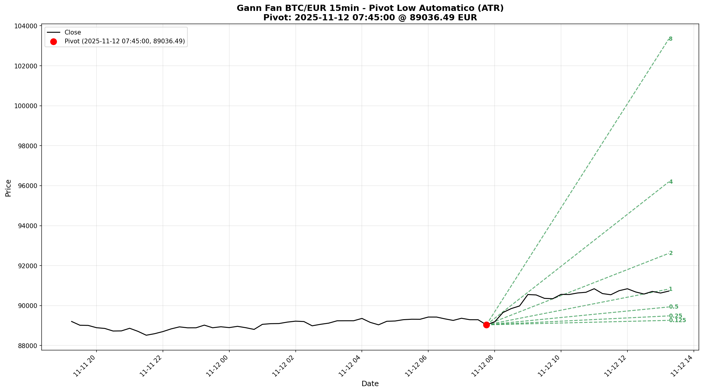
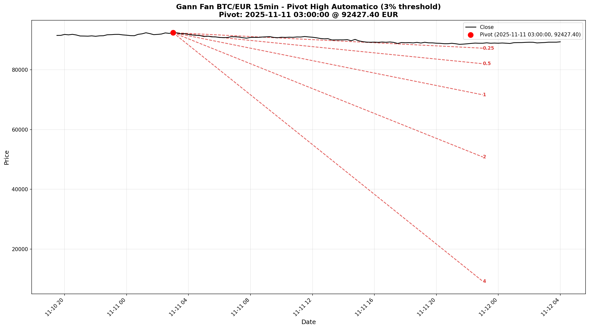
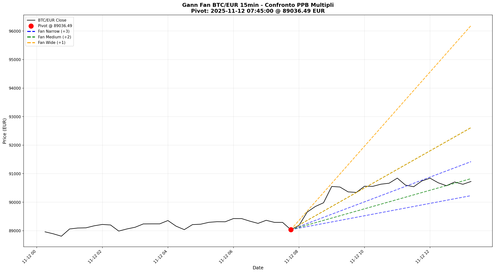

# Gann Fan

[](https://www.python.org/downloads/)
[](LICENSE)

Modulo Python completo e robusto per il calcolo, la costruzione e la visualizzazione del **ventaglio di Gann** (Gann Fan), con rigorosa attenzione alla correttezza matematica, ripetibilità dei risultati e qualità del codice.

## Esempi Visivi

### Pivot Low con ATR


Ventaglio di Gann costruito dall'ultimo pivot low rilevato automaticamente. Le linee verdi rappresentano i ratios di supporto (1/8, 1/4, 1/2, 1, 2, 4, 8) proiettati in avanti usando il Price Per Bar calcolato dall'ATR.

### Pivot High con ATR


Ventaglio di Gann costruito dall'ultimo pivot high. Le linee rosse rappresentano i ratios di resistenza proiettati verso il basso dal massimo rilevato.

### Confronto Multiple Timeframes


Sovrapposizione di tre ventagli con diversi parametri PPB (narrow, medium, wide) per analizzare multiple velocità di movimento del prezzo. Utile per identificare zone di confluenza tra diversi timeframes.

## Caratteristiche

- ✅ **Calcolo matematicamente rigoroso** dell'Average True Range (ATR) con metodi SMA e Wilder
- ✅ **Rilevamento deterministico dei pivot** con metodi percentuali e basati su ATR
- ✅ **Costruzione completa del ventaglio di Gann** con ratios configurabili
- ✅ **Visualizzazione professionale** con matplotlib
- ✅ **API pulita** con type hints completi e docstring NumPy-style
- ✅ **Test automatizzati** per tutte le funzioni principali
- ✅ **Interfaccia a riga di comando** per elaborazione batch
- ✅ **Gestione robusta degli errori** con messaggi informativi

## Installazione

### Da sorgente

```bash
git clone https://github.com/SebastianMartinNS/gann_fan.git
cd gann_fan
pip install -e .
```

### Installazione dipendenze di sviluppo

```bash
pip install -e ".[dev]"
```

## Utilizzo

### Come libreria Python

```python
import pandas as pd
from gann_fan.core import gann_fan
from gann_fan.plot import plot_fan_with_date
import matplotlib.pyplot as plt

# Carica dati
df = pd.read_csv("BTC_EUR_1h.csv", parse_dates=["Date"])
df = df.sort_values("Date").reset_index(drop=True)

# Calcola il ventaglio di Gann
fan = gann_fan(
    df,
    pivot_source="last_low",      # Usa l'ultimo pivot low
    pivot_mode="atr",              # Rileva pivot con ATR
    atr_len=14,                    # Periodo ATR
    atr_mult=1.2,                  # Moltiplicatore ATR per pivot
    atr_method="sma",              # Metodo ATR (sma o wilder)
    ppb_mode="ATR",                # Calcola ppb da ATR
    atr_divisor=1.5,               # Divisore per ppb
    ratios=[1/8, 1/4, 1/2, 1, 2, 4, 8],  # Ratios del ventaglio
    bars_forward=400               # Proiezione in avanti
)

# Stampa informazioni
print(f"Pivot: indice={fan.pivot_idx}, prezzo={fan.pivot_price:.2f}")
print(f"Price Per Bar: {fan.ppb:.6f}")
print(f"Numero linee: {len(fan.lines)}")

# Visualizza
ax = plot_fan_with_date(df, fan, date_col="Date", show_labels=True)
plt.show()
```

### Da riga di comando

```bash
python -m gann_fan.cli \
    --csv BTC_EUR_1h.csv \
    --pivot_source last_low \
    --pivot_mode atr \
    --atr_len 14 \
    --atr_mult 1.2 \
    --atr_method sma \
    --ppb_mode ATR \
    --atr_divisor 1.5 \
    --ratios "0.125,0.25,0.5,1,2,4,8" \
    --bars_forward 400 \
    --out gann_btc_eur_1h.png
```

## Documentazione API

### Funzioni principali

#### `atr(df, length=14, method="sma")`

Calcola l'Average True Range.

**Parametri:**
- `df`: DataFrame con colonne `High`, `Low`, `Close`
- `length`: Periodo di calcolo (default: 14)
- `method`: `"sma"` o `"wilder"` (default: `"sma"`)

**Formule:**

True Range:
```
TR_t = max(High_t - Low_t, |High_t - Close_{t-1}|, |Low_t - Close_{t-1}|)
```

ATR (SMA):
```
ATR_t = (1/n) * Σ(TR_i da t-n+1 a t)
```

ATR (Wilder):
```
ATR_t = ((ATR_{t-1} * (n-1)) + TR_t) / n
```

---

#### `pivots_percent(df, threshold, price_col="Close")`

Rileva pivot points usando metodo percentuale.

**Parametri:**
- `df`: DataFrame con dati di prezzo
- `threshold`: Soglia percentuale (es. 0.05 per 5%)
- `price_col`: Colonna da usare (default: `"Close"`)

**Returns:** `(highs, lows)` dove ognuno è `List[Tuple[int, float]]`

**Logica:**
- Se `(P_t - P_pivot) / P_pivot >= threshold` → registra pivot low
- Se `(P_pivot - P_t) / P_pivot >= threshold` → registra pivot high

---

#### `pivots_atr(df, atr_len=14, atr_mult=1.0, method="sma", price_col="Close")`

Rileva pivot points usando ATR come soglia.

**Parametri:**
- `df`: DataFrame con colonne `High`, `Low`, `Close`
- `atr_len`: Periodo ATR (default: 14)
- `atr_mult`: Moltiplicatore ATR (default: 1.0)
- `method`: Metodo ATR (default: `"sma"`)
- `price_col`: Colonna prezzo (default: `"Close"`)

**Returns:** `(highs, lows)` dove ognuno è `List[Tuple[int, float]]`

**Logica:**
- Se `P_t - P_pivot >= ATR_t * k` → registra low
- Se `P_pivot - P_t >= ATR_t * k` → registra high

---

#### `compute_ppb(df, mode, atr_len=14, atr_method="sma", atr_divisor=1.0, fixed_ppb=1.0, pivot_idx=0)`

Calcola il Price Per Bar.

**Parametri:**
- `df`: DataFrame con dati
- `mode`: `"ATR"` o `"Fixed"`
- Altri parametri per configurare il calcolo

**Returns:** `float` - valore ppb

**Formule:**
- Modalità ATR: `ppb = ATR_{pivot} / atr_divisor`
- Modalità Fixed: `ppb = fixed_ppb`

---

#### `gann_fan(df, pivot_source="last_low", pivot_mode="atr", ...)`

Calcola il ventaglio di Gann completo.

**Parametri principali:**
- `pivot_source`: `"last_low"`, `"last_high"`, o `"custom"`
- `pivot_mode`: `"atr"` o `"percent"` (per rilevamento automatico)
- `threshold`: Soglia per `pivot_mode="percent"`
- `atr_len`, `atr_mult`, `atr_method`: Parametri per ATR e pivot
- `ppb_mode`: `"ATR"` o `"Fixed"`
- `atr_divisor`, `fixed_ppb`: Parametri per ppb
- `ratios`: Lista di ratios (default: `[1/8, 1/4, 1/3, 1/2, 1, 2, 3, 4, 8]`)
- `bars_forward`: Numero di barre di proiezione
- `custom_pivot`: `(idx, price)` per pivot custom

**Returns:** `FanResult` con:
- `pivot_idx`: Indice del pivot
- `pivot_price`: Prezzo del pivot
- `ppb`: Price Per Bar
- `lines`: Lista di `FanLine`

**Equazione delle linee:**
```
P(t) = P_0 ± r * ppb * (t - t_0)
```

dove:
- `P_0`: prezzo del pivot
- `r`: ratio della linea
- `ppb`: price per bar
- `t_0`: indice del pivot

---

### Strutture dati

#### `FanLine`

```python
@dataclass
class FanLine:
    ratio: float              # Ratio della linea (es. 1/8, 1, 2, 8)
    direction: str            # "up" o "down"
    start_idx: int            # Indice di inizio (pivot)
    end_idx: int              # Indice di fine
    y0: float                 # Prezzo iniziale
    y1: float                 # Prezzo finale
```

#### `FanResult`

```python
@dataclass
class FanResult:
    pivot_idx: int            # Indice del pivot
    pivot_price: float        # Prezzo del pivot
    ppb: float                # Price Per Bar
    lines: List[FanLine]      # Lista di linee del ventaglio
```

---

### Visualizzazione

#### `plot_fan(df, fan, ax=None, show_labels=True, figsize=(14, 8))`

Visualizza il ventaglio con indici numerici sull'asse x.

#### `plot_fan_with_date(df, fan, date_col="Date", ax=None, show_labels=True, figsize=(14, 8))`

Visualizza il ventaglio con date sull'asse x.

**Returns:** `matplotlib.axes.Axes`

## Test

Esegui tutti i test:

```bash
pytest
```

Esegui con coverage:

```bash
pytest --cov=gann_fan --cov-report=html
```

### Test inclusi

- ✅ Calcolo ATR con SMA e Wilder
- ✅ Rilevamento pivot percentuale
- ✅ Rilevamento pivot ATR-based
- ✅ Calcolo ppb in modalità ATR e Fixed
- ✅ Costruzione ventaglio completo
- ✅ Correttezza equazioni linee
- ✅ Gestione errori (colonne mancanti, parametri invalidi, pivot non trovati)
- ✅ Edge cases (DataFrame corti, ratios duplicati, pivot al limite)

## Parametri CLI completi

```
--csv PATH                File CSV input (obbligatorio)
--pivot_source STR        last_low|last_high|custom (default: last_low)
--pivot_mode STR          atr|percent (default: atr)
--threshold FLOAT         Soglia percentuale (default: 0.05)
--atr_len INT            Periodo ATR (default: 14)
--atr_mult FLOAT         Moltiplicatore ATR (default: 1.0)
--atr_method STR         sma|wilder (default: sma)
--ppb_mode STR           ATR|Fixed (default: ATR)
--atr_divisor FLOAT      Divisore ATR per ppb (default: 1.0)
--fixed_ppb FLOAT        PPB fisso (default: 1.0)
--ratios STR             Ratios separati da virgola (default: "0.125,0.25,0.333,0.5,1,2,3,4,8")
--bars_forward INT       Barre di proiezione (default: 100)
--pivot_idx INT          Indice pivot custom
--pivot_price FLOAT      Prezzo pivot custom
--out PATH               File PNG output (default: gann_fan.png)
--date_col STR           Nome colonna date (default: Date)
--no_labels              Non mostrare etichette ratios
```

## Formato CSV richiesto

Il file CSV deve contenere almeno le seguenti colonne:

- `High`: Prezzo massimo
- `Low`: Prezzo minimo
- `Close`: Prezzo di chiusura
- `Date` (opzionale): Data/timestamp

**Esempio:**

```csv
Date,Open,High,Low,Close,Volume
2024-01-01 00:00:00,42000,42500,41800,42200,1000000
2024-01-01 01:00:00,42200,42800,42100,42600,950000
2024-01-01 02:00:00,42600,43000,42500,42900,1100000
...
```

**Nota:** I dati devono essere ordinati cronologicamente e avere granularità costante.

## Edge Cases gestiti

- ✅ **Serie troppo corta**: Solleva `ValueError` con messaggio chiaro
- ✅ **Nessun pivot trovato**: Suggerisce di ridurre threshold o aumentare dati
- ✅ **Dati non ordinati**: Possono essere ordinati con `.sort_values().reset_index(drop=True)`
- ✅ **Ratios duplicati**: Vengono automaticamente rimossi e ordinati
- ✅ **ATR NaN al pivot**: Errore con suggerimento di aumentare lunghezza o ridurre atr_len
- ✅ **Parametri non validi**: Validazione completa con messaggi dettagliati

## Esempi avanzati

### Uso di pivot custom

```python
# Specifica manualmente un pivot
fan = gann_fan(
    df,
    pivot_source="custom",
    custom_pivot=(250, 45000.0),  # Indice 250, prezzo 45000
    ppb_mode="Fixed",
    fixed_ppb=50.0,
    ratios=[1, 2, 4],
    bars_forward=200
)
```

### Confronto metodi ATR

```python
# Confronta SMA vs Wilder
fan_sma = gann_fan(df, atr_method="sma", ...)
fan_wilder = gann_fan(df, atr_method="wilder", ...)

fig, (ax1, ax2) = plt.subplots(1, 2, figsize=(20, 8))
plot_fan(df, fan_sma, ax=ax1)
ax1.set_title("ATR con SMA")
plot_fan(df, fan_wilder, ax=ax2)
ax2.set_title("ATR con Wilder")
plt.show()
```

### Pivot multipli (estensione futura)

Attualmente il modulo supporta un singolo pivot per ventaglio. Per analizzare più pivot, è possibile chiamare `gann_fan()` più volte e sovrapporre i risultati.

## Principi di design

### Ripetibilità

Tutti i calcoli sono **deterministici**: stessi input producono sempre stessi output. Non c'è randomness o logica ambigua.

### Trasparenza matematica

Ogni formula è:
- ✅ Documentata nel codice
- ✅ Spiegata nel README
- ✅ Verificata con test

### Validazione rigorosa

Ogni funzione valida:
- ✅ Presenza colonne richieste
- ✅ Range parametri (threshold > 0, atr_len ≥ 1, ecc.)
- ✅ Disponibilità dati (ATR calcolabile, pivot validi)
- ✅ Coerenza input (pivot_idx in range, bars_forward > 0)

### Gestione errori

Ogni errore include:
- ✅ Descrizione chiara del problema
- ✅ Suggerimento per risolverlo
- ✅ Valori coinvolti per debugging

## Performance

Il modulo è ottimizzato per dataset di dimensioni tipiche (1000-100000 righe). Per dataset molto grandi (>1M righe), considerare:

- Ridurre il numero di ratios
- Limitare bars_forward
- Pre-filtrare i dati per intervallo temporale rilevante

## Acceptance Criteria

✅ **Importazione senza errori**: `import gann_fan` funziona  
✅ **FanResult valido**: Contiene pivot_idx, pivot_price, ppb, lines  
✅ **CLI produce PNG**: Comando CLI genera immagine corretta  
✅ **Test passati**: `pytest` completa senza errori  
✅ **Documentazione completa**: README con formule e esempi  
✅ **Type hints**: Tutte le funzioni pubbliche hanno type hints  
✅ **Docstrings**: Formato NumPy-style per tutte le API  

## Estensioni future (opzionali)

- 🔮 **Multi-pivot support**: Ventagli da più pivot simultanei
- 🔮 **Filtro regime ADX**: Disabilitare pivot in bassa volatilità
- 🔮 **Export GeoJSON**: Per integrazione con sistemi GIS/mapping
- 🔮 **Backtesting framework**: Valutare efficacia strategie basate su Gann
- 🔮 **Streaming mode**: Aggiornamento real-time del ventaglio

## Licenza

MIT License - vedi file LICENSE per dettagli

## Contributi

I contributi sono benvenuti! Per favore:

1. Assicurati che tutti i test passino
2. Aggiungi test per nuove funzionalità
3. Segui PEP8 e usa type hints
4. Aggiorna la documentazione

## Autore

Sebastian Martin - [@SebastianMartinNS](https://github.com/SebastianMartinNS)

## Note tecniche

### Calcolo True Range

Il True Range considera i gap tra sessioni usando il Close precedente:

```python
TR = max(
    High - Low,           # Range della barra corrente
    |High - Close_prev|,  # Gap up
    |Low - Close_prev|    # Gap down
)
```

### Smoothing Wilder vs SMA

**Wilder's smoothing** è simile a una EMA con α = 1/n:
```
ATR_t = ATR_{t-1} + (1/n) * (TR_t - ATR_{t-1})
```

**SMA** è la media aritmetica semplice:
```
ATR_t = (1/n) * Σ(TR_i)
```

Wilder è più smooth e meno reattivo ai cambiamenti recenti.

### Ratios classici di Gann

I ratios `[1/8, 1/4, 1/3, 1/2, 1, 2, 3, 4, 8]` corrispondono agli angoli tradizionali di Gann:
- 1x1 (45°) → ratio = 1
- 2x1 (63.43°) → ratio = 2
- 4x1 (75.96°) → ratio = 4
- 8x1 (82.87°) → ratio = 8
- 1x2 (26.57°) → ratio = 1/2
- 1x4 (14.04°) → ratio = 1/4
- 1x8 (7.13°) → ratio = 1/8

Il ppb (Price Per Bar) determina lo scaling verticale.

---

**Buon trading con il ventaglio di Gann! 📈**
